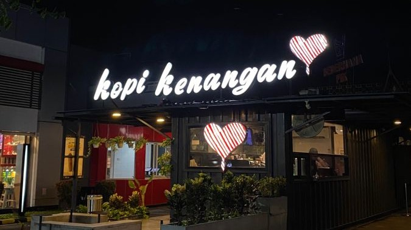

# ☕ Monokrom Coffee

<p align="center">
  
</p>

<p align="center">
  <b>Aplikasi Rekomendasi Coffee Shop Terbaik di Indonesia</b><br/>
  Temukan, eksplorasi, dan simpan kedai kopi favoritmu dalam satu genggaman.
</p>

<p align="center">
  
  
  
  
</p>

---

## 📱 Tentang Aplikasi

**Monokrom Coffee** adalah aplikasi Android berbasis Java yang membantu pengguna menemukan rekomendasi coffee shop terbaik. Aplikasi ini menampilkan 5 coffee shop populer di Indonesia lengkap dengan informasi menu, lokasi, ulasan, dan fitur favorit. Dilengkapi dengan **Barista AI** berbasis Gemini 2.5 Flash untuk pengalaman interaktif bagi pecinta kopi.

---

## ✨ Fitur Utama

### 🔐 1. Autentikasi (Login & Register)
Sistem autentikasi menggunakan **Firebase Authentication**.

| Halaman | Deskripsi |
|---------|-----------|
| **Splash Screen** | Layar pembuka animasi saat aplikasi pertama dibuka |
| **Get Started** | Halaman onboarding selamat datang dengan tombol masuk/daftar |
| **Login** | Masuk menggunakan email dan password via Firebase Auth |
| **Register** | Daftar akun baru dengan nama, email, dan password |

---

### 🏠 2. Home (Beranda)
Halaman utama yang menampilkan daftar coffee shop dan rekomendasi menu.

#### 📌 Fitur di Beranda:
- **Banner Slider Otomatis** — Menampilkan 3 banner promosi yang berganti otomatis setiap 3 detik dengan indikator titik (dots indicator).
- **Sapaan Pengguna** — Menampilkan nama pengguna yang sedang login.
- **Filter Chip** — Filter cepat untuk menyortir daftar coffee shop:
  | Chip | Fungsi |
  |------|--------|
  | 🟤 Semua | Menampilkan semua coffee shop |
  | 📍 Terdekat | Mengurutkan berdasarkan jarak terdekat |
  | ⭐ Rating | Menampilkan coffee shop dengan rating ≥ 4.8 |
  | 🔥 Populer | Mengurutkan berdasarkan popularitas/jumlah ulasan |
  | 🆕 Baru | Menampilkan brand kopi yang lebih baru (Tomoro & Point) |
- **Search Bar** — Pencarian coffee shop secara real-time berdasarkan nama.
- **Daftar Coffee Shop** — 5 coffee shop dalam bentuk kartu yang bisa diklik untuk melihat detail.
- **Rekomendasi Menu** — Menampilkan 3 kartu menu unggulan (Caramel Latte, Kopi Susu, Oat Latte) yang mengarah ke coffee shop terkait.

#### 🏪 Coffee Shop yang Tersedia:
| # | Nama | Rating | Kisaran Harga |
|---|------|--------|---------------|
| 1 | ☕ Kenangan Coffee | ⭐ 4.8 | Rp 15k – 35k |
| 2 | 🟢 Starbucks Coffee | ⭐ 4.9 | Rp 45k – 80k |
| 3 | 🟠 Tomoro Coffee | ⭐ 4.7 | Rp 12k – 25k |
| 4 | 🟡 Janji Jiwa Coffee | ⭐ 4.6 | Rp 15k – 30k |
| 5 | 🟩 Point Coffee | ⭐ 4.8 | Rp 20k – 40k |

---

### 🗂️ 3. Detail Coffee Shop
Halaman lengkap informasi setiap coffee shop.

#### 📌 Informasi yang Ditampilkan:
- **Logo & Banner** coffee shop
- **Nama, Deskripsi, Rating, Jumlah Ulasan**
- **Alamat & Rata-rata Harga**
- **Tombol Favorit** — Simpan atau hapus dari daftar favorit
- **Tombol Tulis Ulasan** — Memberikan ulasan & rating bintang
- **Tombol Lihat Lokasi** — Buka peta interaktif

#### 🍵 Filter Menu:
Setiap coffee shop memiliki **9 menu** yang dapat difilter berdasarkan kategori:

| Kategori | Menu (per coffee shop) |
|----------|------------------------|
| ☕ **Hot Coffee** (3 menu) | Kopi panas pilihan |
| 🧊 **Ice Coffee** (3 menu) | Kopi dingin segar |
| 🥤 **Non Coffee** (3 menu) | Minuman non-kopi (matcha, coklat, smoothie, dll.) |

#### Menu Lengkap per Coffee Shop:

<details>
<summary><b>☕ Kenangan Coffee</b></summary>

| Kategori | Menu | Harga |
|----------|------|-------|
| Hot | Milo Kenangan | Rp 20k |
| Hot | Caffe Latte | Rp 15k |
| Hot | Carramel Latte | Rp 18k |
| Ice | Cappucino Coffee | Rp 18k |
| Ice | Caffe Latte | Rp 20k |
| Ice | Hazelnut Coffee | Rp 23k |
| Non Coffee | Kenangan Milo | Rp 22k |
| Non Coffee | Chocolate Kenangan | Rp 21k |
| Non Coffee | Matcha Kenangan | Rp 19k |

</details>

<details>
<summary><b>🟢 Starbucks Coffee</b></summary>

| Kategori | Menu | Harga |
|----------|------|-------|
| Hot | Coffee Cappucino | Rp 35k |
| Hot | Coffee Caramel | Rp 40k |
| Hot | Salted Machiato | Rp 42k |
| Ice | Coffee Pistachio | Rp 50k |
| Ice | Coffee Cappucino | Rp 48k |
| Ice | Coffee Salted Caramel | Rp 45k |
| Non Coffee | Blackberry Smoothie | Rp 44k |
| Non Coffee | Chocolate | Rp 52k |
| Non Coffee | Matcha Latte | Rp 46k |

</details>

<details>
<summary><b>🟠 Tomoro Coffee</b></summary>

| Kategori | Menu | Harga |
|----------|------|-------|
| Hot | Kopi Hitam | Rp 12k |
| Hot | Caramel Coffee | Rp 15k |
| Hot | Coffee Latte | Rp 18k |
| Ice | Es Kopi Susu Gula Aren | Rp 17k |
| Ice | Iced Americano | Rp 16k |
| Ice | Vietnamese Coffee | Rp 19k |
| Non Coffee | Chocolate Milk | Rp 14k |
| Non Coffee | Orange Smoothie | Rp 16k |
| Non Coffee | Matcha Latte | Rp 15k |

</details>

<details>
<summary><b>🟡 Janji Jiwa Coffee</b></summary>

| Kategori | Menu | Harga |
|----------|------|-------|
| Hot | Hazelnut Latte | Rp 13k |
| Hot | Americano Coffee | Rp 14k |
| Hot | Caramel Latte | Rp 16k |
| Ice | Cappucino Latte | Rp 15k |
| Ice | Coffee Latte | Rp 18k |
| Ice | Es Kopi Susu | Rp 20k |
| Non Coffee | Matcha Latte | Rp 17k |
| Non Coffee | Red Velvet | Rp 19k |
| Non Coffee | Chocolate | Rp 16k |

</details>

<details>
<summary><b>🟩 Point Coffee</b></summary>

| Kategori | Menu | Harga |
|----------|------|-------|
| Hot | Cappucino Latte | Rp 28k |
| Hot | Marshmallow Coffee | Rp 30k |
| Hot | Caramel Latte | Rp 25k |
| Ice | Coffee Latte | Rp 27k |
| Ice | Caramel Latte | Rp 29k |
| Ice | Palm Sugar | Rp 32k |
| Non Coffee | Matcha Premium | Rp 30k |
| Non Coffee | Cream Cookies | Rp 26k |
| Non Coffee | Cream Oreo Matcha | Rp 28k |

</details>

---

### 🗺️ 4. Lokasi (Maps)
Menampilkan lokasi coffee shop menggunakan **OpenStreetMap (OSMDroid)**.

| Coffee Shop | Lokasi |
|-------------|--------|
| Kenangan Coffee | Chadstone Mall Cikarang, Bekasi |
| Starbucks Coffee | Citywalk Lippo Cikarang, Bekasi |
| Tomoro Coffee | Ruko Hollywood Plaza, Jababeka, Bekasi |
| Janji Jiwa Coffee | Jl. Kasuari Raya, Jababeka II, Bekasi |
| Point Coffee | Ruko Easton Commercial Center, Cikarang Selatan, Bekasi |

- 📌 Marker interaktif di titik lokasi coffee shop
- 🗺️ Mode peta gelap (Dark Mode) yang menyesuaikan tema aplikasi
- 📋 Informasi nama, alamat lengkap, dan jam buka (08:00–22:00)

---

### ❤️ 5. Favorit
Halaman daftar coffee shop yang telah disimpan pengguna.

- **Simpan Favorit** — Tandai coffee shop favorit dari halaman detail
- **Hapus Favorit** — Hapus dari daftar langsung tanpa reload halaman
- **Empty State** — Tampilan khusus saat belum ada favorit tersimpan
- **Jumlah Tersimpan** — Menampilkan total coffee shop favorit
- Data tersimpan menggunakan **SharedPreferences + Gson**

---

### ✍️ 6. Ulasan (Review)
Fitur untuk memberikan ulasan pada setiap coffee shop.

- **Tulis Ulasan** — Bottom Sheet dialog untuk mengisi ulasan baru
- **Rating Bintang** — Penilaian 1–5 bintang
- **Edit Ulasan** — Perbarui ulasan yang sudah pernah ditulis
- **Tampilan Ulasan** — Semua ulasan ditampilkan di halaman detail coffee shop
- **Empty State** — Tampilan khusus jika belum ada ulasan
- Data tersimpan menggunakan **SharedPreferences + Gson**

---

### 🤖 7. Barista AI (Chatbot)
Asisten kopi cerdas bertenaga **Google Gemini 2.5 Flash**.

- 💬 **Chat Interaktif** — Tanya apa saja seputar kopi dalam Bahasa Indonesia
- 🧠 **Memori Percakapan** — Menyimpan riwayat chat dalam satu sesi
- 📚 **Topik yang Bisa Ditanyakan:**
  - Rekomendasi menu kopi
  - Jenis-jenis kopi & cara brew
  - Fakta menarik seputar kopi
  - Info tentang Monokrom Coffee
- ⚡ Muncul sebagai **Bottom Sheet** yang bisa diakses kapan saja
- Tampilan pesan user & bot yang berbeda (bubble chat)
- Loading indicator saat menunggu respons AI

---

### ⚙️ 8. Pengaturan (Settings)
Halaman konfigurasi akun dan preferensi aplikasi.

| Fitur | Deskripsi |
|-------|-----------|
| 👤 **Profil Pengguna** | Tampilkan nama & email dari Firebase Auth |
| 📷 **Foto Profil** | Upload foto dari galeri, disimpan ke internal storage |
| 🌙 **Dark Mode** | Toggle tema gelap/terang secara real-time |
| ❤️ **Favorit Saya** | Shortcut ke halaman favorit |
| 🔑 **Ganti Password** | Ubah password akun via Firebase Auth |
| ℹ️ **Tentang Aplikasi** | Info versi dan deskripsi aplikasi |
| 🔄 **Pindah Akun** | Logout untuk ganti akun |
| 🚪 **Keluar** | Logout dari sesi aktif |
| 🗑️ **Hapus Akun** | Hapus akun secara permanen dari Firebase |

---

## 🧭 Navigasi Aplikasi

Aplikasi menggunakan **Bottom Navigation Bar** dengan 4 menu utama:

```
┌─────────┬──────────┬───────────┬────────────┐
│  🏠 Home │ ❤️ Favorit│ 🤖 Barista │ ⚙️ Settings │
└─────────┴──────────┴───────────┴────────────┘
```

---

## 🛠️ Teknologi yang Digunakan

| Teknologi | Kegunaan |
|-----------|----------|
| **Java** | Bahasa pemrograman utama |
| **Android SDK** | Platform pengembangan |
| **Firebase Authentication** | Login, Register, Ganti Password, Hapus Akun |
| **Google Gemini 2.5 Flash API** | AI Chatbot (Barista AI) |
| **OSMDroid (OpenStreetMap)** | Tampilan peta interaktif |
| **OkHttp** | HTTP client untuk komunikasi API Gemini |
| **Glide** | Loading & transformasi gambar (foto profil) |
| **Gson** | Serialisasi data favorit & ulasan |
| **SharedPreferences** | Penyimpanan data lokal (favorit, ulasan, tema) |
| **Material Design Components** | Switch, Bottom Sheet, Bottom Navigation |
| **ViewPager2** | Banner slider di beranda |

---

## 📂 Struktur Proyek

```
app/src/main/java/com/example/monokromcoffee/
│
├── 🔐 Auth
│   ├── splashscreen.java          # Splash Screen
│   ├── GetStartedActivity.java    # Onboarding
│   ├── LoginActivity.java         # Halaman Login
│   └── RegisterActivity.java      # Halaman Register
│
├── 🏠 Main
│   ├── MainActivity.java          # Activity utama + Bottom Nav
│   └── HomeFragment.java          # Fragment beranda
│
├── 🏪 Coffee Shop
│   ├── CoffeeShop.java            # Model data coffee shop
│   ├── CoffeeDetailActivity.java  # Halaman detail coffee shop
│   └── MapsActivity.java          # Halaman peta lokasi
│
├── ❤️ Favorit
│   ├── FavoriteFragment.java      # Fragment favorit
│   ├── FavoriteManager.java       # Manajemen data favorit
│   └── FavoriteCoffeeAdapter.java # Adapter RecyclerView favorit
│
├── ✍️ Ulasan
│   ├── Review.java                # Model data ulasan
│   ├── ReviewFragment.java        # Fragment ulasan (tab)
│   ├── ReviewManager.java         # Manajemen data ulasan
│   ├── ReviewAdapter.java         # Adapter RecyclerView ulasan
│   └── WriteReviewBottomSheet.java# Bottom Sheet tulis ulasan
│
├── 🤖 Chatbot
│   ├── ChatbotBottomSheet.java    # Bottom Sheet Barista AI
│   ├── ChatMessage.java           # Model pesan chat
│   └── ChatMessageAdapter.java    # Adapter chat bubble
│
├── ⚙️ Pengaturan
│   └── SettingsFragment.java      # Fragment pengaturan
│
└── 🎨 UI
    └── BannerSliderAdapter.java   # Adapter banner slider
```

---

## 🚀 Cara Menjalankan

### Prasyarat
- Android Studio (versi terbaru)
- JDK 11 atau lebih tinggi
- Perangkat Android / Emulator (min. API Level 26)
- Koneksi internet untuk Firebase & Gemini AI

### Langkah Instalasi

1. **Clone repository ini:**
   ```bash
   git clone https://github.com/muhammadnaufal1234/RekomendasiaplikasiCoffeeshop_PemogramanMobile.git
   ```

2. **Buka di Android Studio:**
   - File → Open → pilih folder project

3. **Konfigurasi Firebase:**
   - Buat project di [Firebase Console](https://console.firebase.google.com)
   - Download `google-services.json` dan letakkan di folder `app/`
   - Aktifkan **Authentication** → Email/Password

4. **Konfigurasi Gemini API:**
   - Dapatkan API Key di [Google AI Studio](https://aistudio.google.com)
   - Tambahkan di `local.properties`:
     ```
     GEMINI_API_KEY=your_api_key_here
     ```

5. **Sync Gradle dan jalankan aplikasi**

---

## 👨‍💻 Developer

| Info | Detail |
|------|--------|
| **Nama** | Muhammad Naufal |
| **Project** | Pemrograman Mobile |
| **Platform** | Android (Java) |
| **Versi Aplikasi** | 1.1.0 |

---

## 📄 Lisensi

Project ini dibuat untuk keperluan akademik — **Mata Kuliah Pemrograman Mobile**.

---

<p align="center">Made with ❤️ and ☕ by Muhammad Naufal</p>
